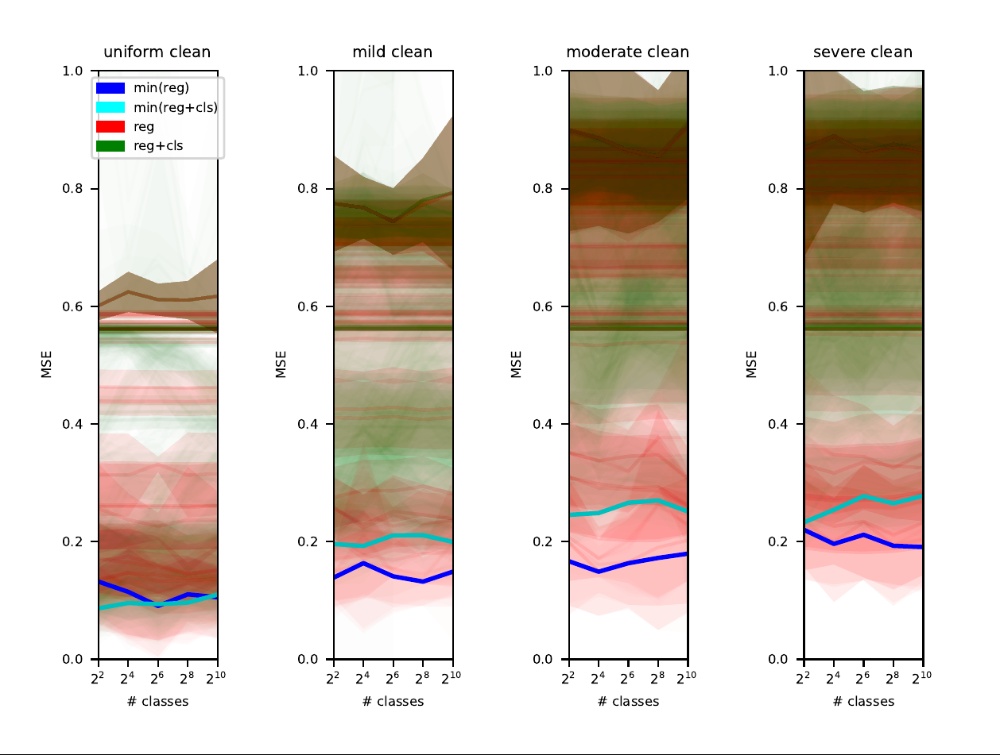

### 1D data
<div style="float:left;">
    <span style='display:inline-block; width:200px; padding: 100px 0;'> &nbsp;&nbsp;&nbsp;&nbsp;&nbsp;&nbsp;&nbsp;&nbsp;&nbsp;&nbsp;&nbsp;&nbsp;&nbsp;&nbsp;&nbsp;&nbsp;&nbsp; Clean 5-hidden nodes (Adam) &nbsp;&nbsp;&nbsp;&nbsp;&nbsp;&nbsp;&nbsp;&nbsp;&nbsp;&nbsp;&nbsp;&nbsp;&nbsp;&nbsp;&nbsp;&nbsp;&nbsp;&nbsp;&nbsp;&nbsp;&nbsp;&nbsp;&nbsp;&nbsp;&nbsp;&nbsp;&nbsp; </span>
    <span style='display:inline-block; width:200px; padding: 100px 0;'> &nbsp;&nbsp;&nbsp;&nbsp;&nbsp;&nbsp;&nbsp;&nbsp;&nbsp;&nbsp;&nbsp;&nbsp;&nbsp;&nbsp;&nbsp;&nbsp;&nbsp;&nbsp; Clean 5-hidden nodes (SGD) 
</div>
<div style="float:left; ">
    
    
</div>

<div style="float:left;">
    <span style='display:inline-block; width:200px; padding: 100px 0;'> &nbsp;&nbsp;&nbsp;&nbsp;&nbsp;&nbsp;&nbsp;&nbsp;&nbsp;&nbsp;&nbsp;&nbsp;&nbsp;&nbsp;&nbsp;&nbsp;&nbsp; Clean 9-hidden nodes (Adam) &nbsp;&nbsp;&nbsp;&nbsp;&nbsp;&nbsp;&nbsp;&nbsp;&nbsp;&nbsp;&nbsp;&nbsp;&nbsp;&nbsp;&nbsp;&nbsp;&nbsp;&nbsp;&nbsp;&nbsp;&nbsp;&nbsp;&nbsp;&nbsp;&nbsp;&nbsp;&nbsp; </span>
    <span style='display:inline-block; width:200px; padding: 100px 0;'> &nbsp;&nbsp;&nbsp;&nbsp;&nbsp;&nbsp;&nbsp;&nbsp;&nbsp;&nbsp;&nbsp;&nbsp;&nbsp;&nbsp;&nbsp;&nbsp;&nbsp;&nbsp; Clean 9-hidden nodes (SGD) 
</div>
<div style="float:left; ">
    
    
</div>

<div style="float:left;">
    <span style='display:inline-block; width:200px; padding: 100px 0;'> &nbsp;&nbsp;&nbsp;&nbsp;&nbsp;&nbsp;&nbsp;&nbsp;&nbsp;&nbsp;&nbsp;&nbsp;&nbsp;&nbsp;&nbsp;&nbsp; Clean 17-hidden nodes (Adam) &nbsp;&nbsp;&nbsp;&nbsp;&nbsp;&nbsp;&nbsp;&nbsp;&nbsp;&nbsp;&nbsp;&nbsp;&nbsp;&nbsp;&nbsp;&nbsp;&nbsp;&nbsp;&nbsp;&nbsp;&nbsp;&nbsp;&nbsp;&nbsp;&nbsp;&nbsp;&nbsp; </span>
    <span style='display:inline-block; width:200px; padding: 100px 0;'> &nbsp;&nbsp;&nbsp;&nbsp;&nbsp;&nbsp;&nbsp;&nbsp;&nbsp;&nbsp;&nbsp;&nbsp;&nbsp;&nbsp;&nbsp;&nbsp;&nbsp;&nbsp; Clean 17-hidden nodes (SGD) 
</div>
<div style="float:left; ">
    
    
</div>

<div style="float:left;">
    <span style='display:inline-block; width:200px; padding: 100px 0;'> &nbsp;&nbsp;&nbsp;&nbsp;&nbsp;&nbsp;&nbsp;&nbsp;&nbsp;&nbsp;&nbsp;&nbsp;&nbsp;&nbsp;&nbsp;&nbsp; Clean 33-hidden nodes (Adam) &nbsp;&nbsp;&nbsp;&nbsp;&nbsp;&nbsp;&nbsp;&nbsp;&nbsp;&nbsp;&nbsp;&nbsp;&nbsp;&nbsp;&nbsp;&nbsp;&nbsp;&nbsp;&nbsp;&nbsp;&nbsp;&nbsp;&nbsp;&nbsp;&nbsp;&nbsp;&nbsp; </span>
    <span style='display:inline-block; width:200px; padding: 100px 0;'> &nbsp;&nbsp;&nbsp;&nbsp;&nbsp;&nbsp;&nbsp;&nbsp;&nbsp;&nbsp;&nbsp;&nbsp;&nbsp;&nbsp;&nbsp;&nbsp;&nbsp;&nbsp; Clean 33-hidden nodes (SGD) 
</div>
<div style="float:left; ">
    
    
</div>

<div style="float:left;">
    <span style='display:inline-block; width:200px; padding: 100px 0;'> &nbsp;&nbsp;&nbsp;&nbsp;&nbsp;&nbsp;&nbsp;&nbsp;&nbsp;&nbsp;&nbsp;&nbsp;&nbsp;&nbsp;&nbsp;&nbsp; Clean 65-hidden nodes (Adam) &nbsp;&nbsp;&nbsp;&nbsp;&nbsp;&nbsp;&nbsp;&nbsp;&nbsp;&nbsp;&nbsp;&nbsp;&nbsp;&nbsp;&nbsp;&nbsp;&nbsp;&nbsp;&nbsp;&nbsp;&nbsp;&nbsp;&nbsp;&nbsp;&nbsp;&nbsp;&nbsp; </span>
    <span style='display:inline-block; width:200px; padding: 100px 0;'> &nbsp;&nbsp;&nbsp;&nbsp;&nbsp;&nbsp;&nbsp;&nbsp;&nbsp;&nbsp;&nbsp;&nbsp;&nbsp;&nbsp;&nbsp;&nbsp;&nbsp;&nbsp; Clean 65-hidden nodes (SGD) 
</div>
<div style="float:left; ">    
    
    
</div>
        
**New:** 
Varying the model number of parameter and doing a thorough hyper-parameter search.</br> 
Hyper-parameter search on the _Clean_ val-set, using the either Adam optimizer or the SGD, when adding a scaling _s_ to both the classification and the regression losses:
```math
L_{reg} = s \mid f(x), y \mid_{2}^{2},
```
```math
L_{reg+cls} = s (\lambda L_{reg} + L_{CE} (\hat{f}(x), \hat{y})),
```
```math
\text{ where }y\text{ is the target and }f(x)\text{ the prediction, }\hat{y}\text{ is the class label and }\hat{f}(x)\text{ the class prediction, and }
```
```math
\lambda\text{ is the scaling between the losses, and }s\text{ is a global loss-scaling hyperparamter.}
```
over the: 

```math
lr \in \{1e-5, 1e-4, 1e-3, 1e-2, 1e-1\}
```
```math
s  \in \{1e-4, 1e-3, 1e-2, 1e-1, 1e+0, 1e+1, 1e+2, 1e+3, 1e+4\}
```
```math
\lambda \in \{1e-4, 1e-3, 1e-2, 1e-1, 1e+0, 1e+1, 1e+2, 1e+3, 1e+4\}                                               
```
Results are over 10 functions repeated with 3 seeds. 

**Observation:** With these losses, when using an Adam optimizer a classification loss helps when the model is large (maybe over-parameterized?). However, for SGD the gain is more clearly visible when the model is small.
<div style="clear:both;"></div>

<hr>

<div style="float:left; ">
    
    
    
</div>

<div style="float:left; ">
    <span style='display:inline-block; width:200px; padding: 100px 0;'> &nbsp;&nbsp;&nbsp;&nbsp;&nbsp;&nbsp;&nbsp;&nbsp;&nbsp;&nbsp;&nbsp;&nbsp;&nbsp;&nbsp;&nbsp;&nbsp;&nbsp;&nbsp;&nbsp;&nbsp;&nbsp;&nbsp;&nbsp;&nbsp; Clean data &nbsp;&nbsp;&nbsp;&nbsp;&nbsp;&nbsp;&nbsp;&nbsp;&nbsp;&nbsp;&nbsp;&nbsp;&nbsp;&nbsp;&nbsp;&nbsp;&nbsp;&nbsp;&nbsp;&nbsp;&nbsp;&nbsp;&nbsp;&nbsp;&nbsp;&nbsp;&nbsp; </span>
    <span style='display:inline-block; width:200px; padding: 100px 0;'> &nbsp;&nbsp;&nbsp;&nbsp;&nbsp;&nbsp;&nbsp;&nbsp;&nbsp;&nbsp;&nbsp;&nbsp;&nbsp;&nbsp;&nbsp;&nbsp;&nbsp;&nbsp;&nbsp;&nbsp;&nbsp;&nbsp;&nbsp;&nbsp; Noisy data &nbsp;&nbsp;&nbsp;&nbsp;&nbsp;&nbsp;&nbsp;&nbsp;&nbsp;&nbsp;&nbsp;&nbsp;&nbsp;&nbsp;&nbsp;&nbsp;&nbsp;&nbsp;&nbsp;&nbsp;&nbsp;&nbsp;&nbsp;&nbsp;&nbsp;&nbsp;&nbsp; </span>
    <span style='display:inline-block; width:200px; padding: 100px 0'> &nbsp;&nbsp;&nbsp;&nbsp;&nbsp;&nbsp;&nbsp;&nbsp;&nbsp;&nbsp;&nbsp;&nbsp;&nbsp;&nbsp;&nbsp;&nbsp;&nbsp;&nbsp;&nbsp;&nbsp;&nbsp;&nbsp;&nbsp;&nbsp; OOD data </span>
</div>

Results when the losses are
```math
L_{reg} = \mid f(x), y \mid_{2}^{2},\text{ where }y\text{ is the target and }f(x)\text{ the prediction}
```
```math
L_{reg+cls} = \lambda L_{reg} + L_{CE} (\hat{f}(x), \hat{y}),\text{ where }\hat{y}\text{ is the class label and }\hat{f}(x)\text{ the class prediction}
```
<div style="clear:both;"></div>

### Requirements
The code was tested on Linux (Ubuntu 22.04.5 LTS):
- python 3.10
- pytorch 2.0.1+cu117 (https://pytorch.org/) with additional packages:
    - torchvision 0.15.2
- pickle5 0.0.11
- pre-commit 2.17.0
- wandb 0.12.21
- matplotlib 3.5.2

### Organization:

This code is organized as follows:
```
checkpoint/    -- directory where trained models are saved
logs/           -- directory where the training logs are saved
../data         -- directory where the data pickles are saved
    /data1d
data.py         -- defined the dataset class
histeq.py       -- utilities for histogram equalization
main.py         -- main file, defining the arguments and calling the <train_eval.py>
model.py        -- model definitions for <reg> and <reg+cls>
plot.py         -- plotting functions for data and results
train_eval.py   -- the training and evaluation of the complete model
utils.py        -- utilities for printing and loading and saving models
make_data1d.py  -- script for creating all the dataset variations across 10 functions and 5 random seeds.
demo.sh         -- example on training and evaluating one 1 dataset
```

### Usage
#### Step 1) Generate the 1D data
- Run ```python make_data1d.py```

#### Step 2) Train the MLPs
- Edit the ```demo.sh``` file to match the hyper parameters you want to use.
- Run ```bash demo.sh```

#### Step 3) Plot the results
- Run ```python plot.py```
