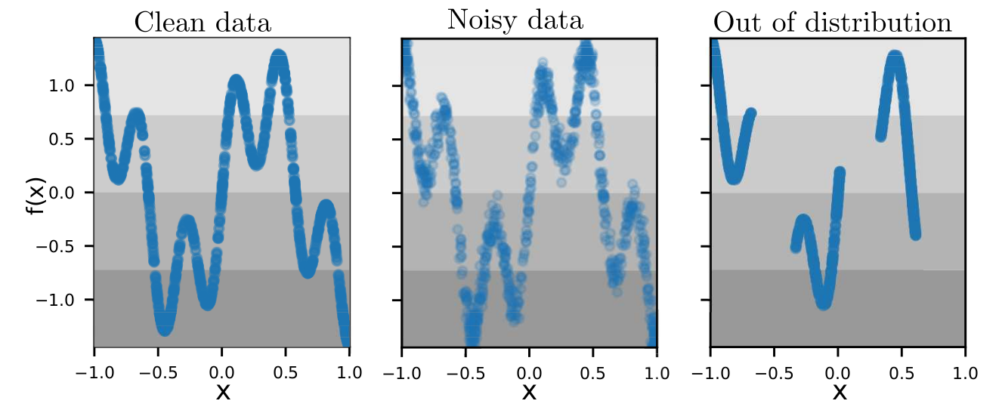
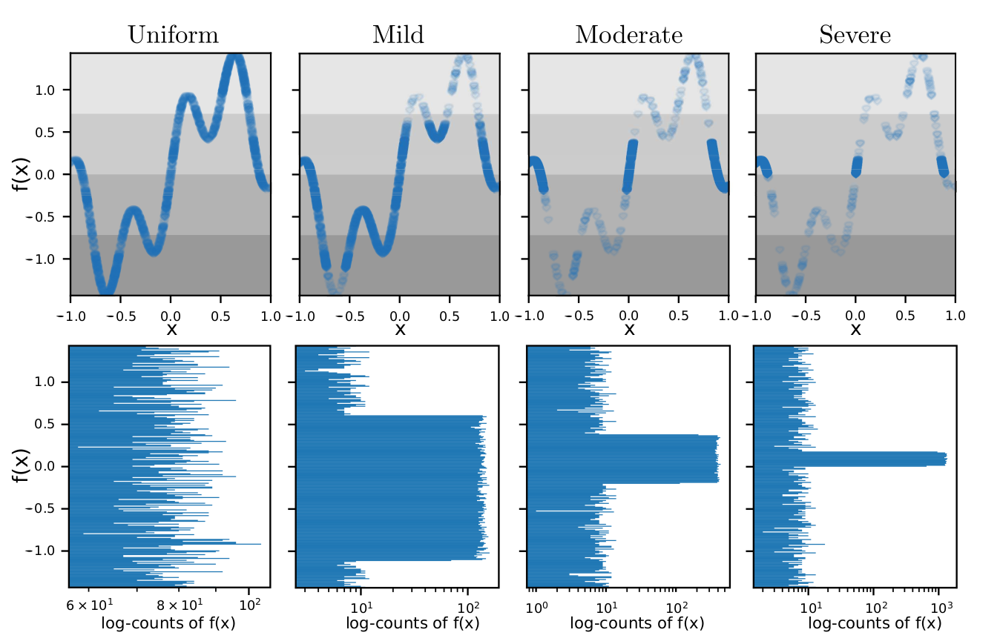
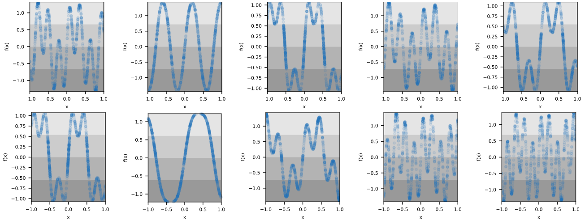

# A step towards understanding why classification helps regression
Python implementation of the experiments from **"A step towards understanding why classification helps regression"**, __Pintea, Silvia L and Yancong, Lin and Dijkstra, Jouke and van Gemert, Jan C, **ICCV**, 2023__.

[<a href="https://arxiv.org/abs/">Arxiv</a>] 


### Overview
A number of computer vision deep regression approaches report improved results when adding a classification loss to the regression loss.
Here, we explore why this is useful in practice and when it is beneficial.
To do so, we start from precisely controlled dataset variations, where we consider three data settings:



and four data samplings:



on 10 randomly sampled functions:



And find that the effect of adding a classification loss is the most pronounced for regression with imbalanced data.
We explain these empirical findings by formalizing the relation between the balanced and imbalanced regression losses.
Finally, we show that our findings hold on two real imbalanced image datasets for depth estimation (NYUD2-DIR), and age estimation (IMDB-WIKI-DIR), and on the problem of imbalanced video progress prediction (Breakfast).
Our main takeaway is: for a regression task, if the data sampling is imbalanced, then add a classification loss.

### Organization
The code for the experiments on **1D data**, **images** (NYUD-DIR, IMDB-DIR), **videos** (Breakfast):

[<a href="https://github.com/SilviaLauraPintea/reg-cls/tree/main/1d">1d data</a>] [<a href="https://github.com/SilviaLauraPintea/reg-cls/tree/main/images">images</a>] 
<!---- [<a href="https://github.com/SilviaLauraPintea/test-reg-cls/tree/main/videos">videos</a>] !-->

For the **image** experiemnts we use the code of:
- <a href="https://github.com/YyzHarry/imbalanced-regression">**"Delving into Deep Imbalanced Regression", Yuzhe Yang, Kaiwen Zha, Ying-Cong Chen, Hao Wang, Dina Katabi _(ICML 2021)_**</a>.

For the **video** experiemnts we adjust the code of:
- <a href="https://github.com/Annusha/unsup_temp_embed/tree/master">**"Unsupervised learning of action classes with continuous temporal embedding", Kukleva, Anna and Kuehne, Hilde and Sener, Fadime and Gall, Jurgen, _(CVPR'19)_**</a>.

All credit for third party sofware/code is with the authors.

### Citation
If you use this code, please cite the publication:
```
@inproceedings{pintea2023a,
  title={A step towards understanding why classification helps regression},
  author={Pintea, Silvia L and Yancong, Lin and Dijkstra, Jouke and van Gemert, Jan C},
  booktitle={Proceedings of the IEEE/CVF International Conference on Computer Vision (ICCV)},
  month={October},
  year={2023},
  pages={}
}
```
