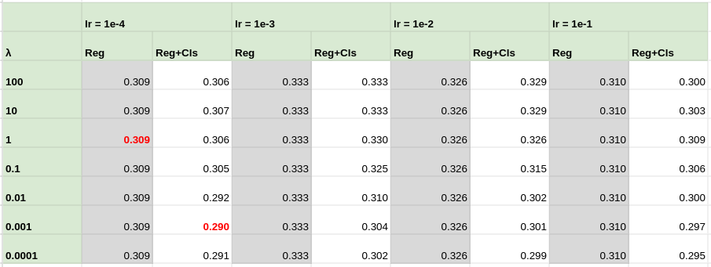

# Third party code from:

### **Unsupervised learning of action classes with continuous temporal embedding**
*Anna Kukleva, and Hilde Kuehne, and Fadime Sener, and Jurgen Gall*

*Conference on Computer Vision and Pattern Recognition (CVPR 2019)*

- Github code: https://github.com/Annusha/unsup_temp_embed

**All rights remain with the authors.**

The only files used are the ones defining the MLP model training and evaluation on video progress prediction (in %):

- ```ute/```
    - ```corpus.py``` -- Calling the MLP training and/or testing.
    - ```ute_pipeline.py``` -- Defining the complete pipeline and arguments.
    - ```video.py``` -- Defines the video class, and targets.
    - ```models/``` -- Defines class ranges such that the class histograms are equalized.
        - ```mlp.py``` -- The MLPs definitions (MLPrelu used here).
        - ```dataset_loader.py``` -- Reads the precomputed features, defines the classes and returns the items per batch
        - ```training_embed.py``` -- Defines the actual training (forward and backward pass) and test (forward) loops over the data.
    - ```utils/``` 
        - ```arg_pars.py``` -- All the parameters used in the code
        - ```histeq.py``` -- The histogram equalization code
        - ```logging_setup.py ``` -- Logging functionality
        - ```util_functions.py ``` -- Administrative utilities (updasting metrics, printing, etc.)
- ```data_utils/```
    - ```bf_train.py``` -- To start training models on the Breakfast dataset 
    - ```bf_test.py``` -- To start testing models on the Breakfast dataset 
    - ```update_argpars.py``` -- Update parameters specifically for Breakfast

------------------------------------

# UTE
## Installation

#### Prerequisites

1. Download and extract the <a href="https://drive.google.com/file/d/1DbYnU2GBb68CxEt2I50QZm17KGYKNR1L"> Breakfast precomputed IDT features</a>

2. Download and extract the <https://drive.google.com/file/d/1RO8lrvLy4bVaxZ7C62R0jVQtclXibLXU"> Breakfast ground truth mapping</a>

- Move the data features to ```<data_utils/data/features>```

- Move the data ground truth to ```<data_utils/data/groundTruth>``` (not used here)

- Move the data mapping to ```<data_utils/data/mapping>``` (not used here)


#### Dependencies

- python 3.10
- pytorch 2.0.1+cu117 (https://pytorch.org/) with additional packages:
    - torchvision 0.15.2
- pre-commit 2.17.0
- pickle5 0.0.11
- matplotlib 3.5.2

## Code Overview

- To run training:

```
python3 data_utils/bf_train.py  
        --erlambda <lambda_weiht> \
        --cls_num <num_classes> \
        --lr <learning_rate> \
        --epochs <num_epochs> \
        --opt <'adam' or 'sgd'> \ 
        --loss <'mse'> \
        --split <'s1', 's2', 's3' or 's4'> 
        --testset_name <'test' or 'val'>
```

#### Running all the experiments 

```bash demo.sh```

<hr/>

New: Redone hyper-pearamter search on the validation set (Using the data split _S1_ and reporting RMSE)



Uodated test results with these parameters:

| RMSE    | S1             |  S2            | S3             | S4             |
|---------|----------------|----------------|----------------|----------------|
| Reg     | 0.281  ± 0.010 | 0.293  ± 0.014 | 0.284  ± 0.009 | 0.283  ± 0.010 |
| Reg+cls | 0.256  ± 0.006 | 0.263  ± 0.007 | 0.255  ± 0.008 | 0.255  ± 0.007 |
